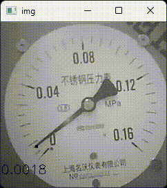

# EdgeLab在Espressif芯片上的部署

<div align="center">
  
  <h3> <a href="https://edgelab.readthedocs.io/en/latest/"> Documentation </a> | <a href="https://edgelab.readthedocs.io/zh_CN/latest/"> 中文文档 </a>  </h3>
</div>

[English](README.md) | 简体中文

- [简介](#简介)
- [环境安装](#环境安装)
  * [安装 ESP IDF](#安装-esp-idf)
- [编译和部署](#编译和部署)
  * [编译例程](#编译例程)
  * [部署例程](#部署例程)

## 简介

本项目提供了将[EdgeLab](https://github.com/Seeed-Studio/Edgelab/)中的模型部署到Espreessif芯片. 本项目基于 [ESP-IDF](https://github.com/espressif/esp-idf) 和 [tensorflow lite micro](https://github.com/tensorflow/tflite-micro). 


## 环境安装

### 安装 ESP IDF

请跟以下指导安装 [ESP-IDF get started guide](https://docs.espressif.com/projects/esp-idf/en/latest/get-started/index.html)以及配置工具链和ESP-IDF.


接下来的步骤假设该安装成功，并且
[IDF环境变量已设置](https://docs.espressif.com/projects/esp-idf/en/latest/get-started/index.html#step-4-set-up-the-environment-variables),
* 设置了`IDF_PATH`环境变量
* `idf.py`和Xtensa-esp32工具（例如，`xtensa-esp32-elf-gcc`）都在`$PATH`。

### 获取子模块

进入到项目的根目录，运行下面的命令来获得子模块。

```
git submodule init
git submodule update examples/esp32/compoents/esp-nn
git submodule update examples/esp32/compoents/esp32-camera
```


## 编译和部署

### 编译例程

进入例子目录（`examples/<example_name>`）并编译例程。

设置IDF_TARGET（对于ESP32-S3目标，需要IDF版本`release/v4.4`）。

```
idf.py set-target esp32s3
```

编译

```
idf.py build
```

### 部署例程

闪存（用设备的串口替换`/dev/ttyUSB0`）。
```
idf.py --port /dev/ttyUSB0 flash
```

监控串行输出。
```
idf.py --port /dev/ttyUSB0 monitor
```

使用`Ctrl+]`来退出。

前面的两个命令可以合并使用。
```
idf.py --port /dev/ttyUSB0 flash monitor
```

```{tips}
请按照相关例程的指导文档了解更多细节。
```


### 性能简介

通过在不同的芯片组上测量，对EdgeLab相关模型的性能总结如下表所示。

| Target | Model | Dataset | Input Resolution | Peak RAM |Inferencing  Time | F1 Score|Link|
| ---- | -----| ---| ---| -----------| --------| --------| --------|
| ESP32-S3 |          Meter         | [custom](https://files.seeedstudio.com/wiki/Edgelab/meter.zip)|112x112 (RGB)| 320KB |     380ms    |  97% |[pfld_meter_int8.tflite](./docs/_static/model_zoo/pfld_meter_int8.tflite)|
| ESP32-S3  |          Fomo          | [custom]()|96x96 (GRAY)| 244KB |    150ms    |  99.5%|[fomo_int8.tflite](./docs/_static/model_zoo/fomo_int8.tflite)|
### 模型演示

#### PFLD 模拟表计


## 贡献
- 如果你在这些例子中发现了问题，或者希望提交一个增强请求，请使用Github上的问题部分。
- 对于ESP-IDF相关的问题请参考[esp-idf](https://github.com/espressif/esp-idf)。
- 对于TensorFlow相关的信息请参考[tflite-micro](https://github.com/tensorflow/tflite-micro)
- 对于EdgeLab相关的信息请参考[EdgeLab](https://github.com/Seeed-Studio/Edgelab/)

## 许可

这些例子是在MIT许可下进行的。

这些例子使用ESP-IDF，它是在Apache许可证2.0下覆盖的。

TensorFlow库代码和第三方代码包含他们自己的许可证，在各自的[repos](https://github.com/tensorflow/tflite-micro)中指定。